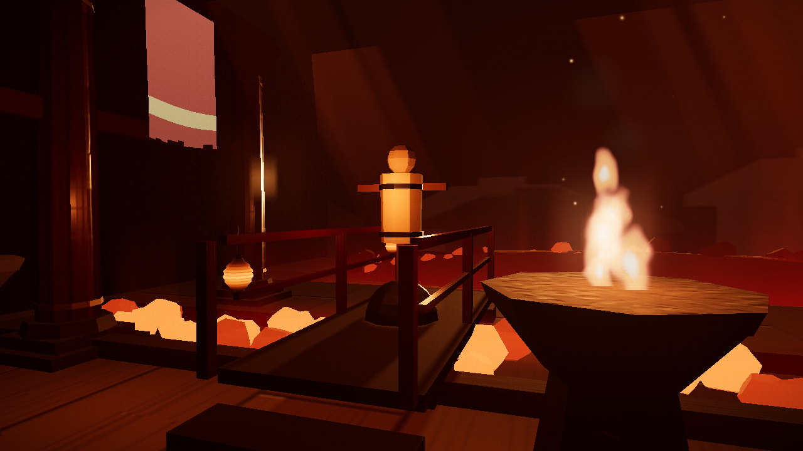

# FIREBENDING



Punch at your webcam and fire comes out of your hands. A browser martial-arts game with no controller, no keyboard, no VR: the camera is the only sensor.

**Try it:** deploy pending, see LAUNCH.md


## How it works

Your webcam feed runs through MediaPipe entirely on your machine. A body-pose landmarker finds your arms first; its wrist positions drive ROI-cropped hand detection, so the hand landmarker works on an upscaled crop of just your hand instead of the whole frame, and handedness comes from which arm the crop belongs to. Landmarks pass through One Euro filters and confidence gates so a jittery hand never becomes a jittery flame.

Thrusts are detected by a fusion gesture engine, not by hand shape: elbow-extension velocity from the pose skeleton is the primary signal, confirmed by wrist speed or apparent hand growth. A punch fires whether your fingers read as a fist or a palm, and when the hand moves too fast for the tracker to hold it, the arm alone carries the detection. A seven-move state machine with hysteresis fires when you commit to a move and never on a single noisy frame. Every projectile and stream is aimed along your hand's filtered velocity, blended with your forearm direction. The hand is the crosshair.

The pipeline: webcam frame, body pose, ROI-cropped hand landmarks, fusion gesture engine, fire.


## The moveset

| Move | Gesture | Effect |
|---|---|---|
| Cinder Bolt | Quick thrust toward the camera, any hand shape | Fast small fireball along your punch line |
| Kiln Lance | Hold the arm extended after a thrust | Narrow sustained jet, steer it with your hand |
| Third Strike Comet | Three alternating thrusts within 1.5 seconds | The third hit upgrades to a heavy comet with knockback |
| Furnace Shot | Both hands together at the chest, then a joint thrust | Giant fireball, screen shake, slow motion on a kill |
| Kindled Wall | Both hands low, fast upward sweep | Wall of flame that blocks incoming projectiles |
| Cinder Lash | Raised grip held, then a fast sideways swing | Arcing whip crack in the swing direction |
| Inner Coal | Both fists at the hips, held one second | Embers gather at your fists; your next move is empowered |


Moves cost Breath, a stamina meter that regenerates when you are not sustaining a flame. Duck to dodge incoming coals, or raise a Kindled Wall to block them.

## Privacy

All processing is client side. The camera feed never leaves your device; pose detection, hand tracking, filtering, and gesture recognition all run in your browser. The only network fetches at load time are the MediaPipe model files, which come from Google's CDN.

## Local development

```sh
npm install
npm run dev       # dev server
npm test          # 624 headless tests, no camera required
npm run build     # typecheck + production build to dist/
npm run studio    # gesture recording studio: capture takes, review, export
npm run analyze   # replay recorded takes through the real engine, propose thresholds
npm run shots     # headless screenshot harness (six station cameras)
npm run perf      # headless perf gate on the real GPU
```

The whole game runs without a webcam via recorded landmark fixtures:

- `?replay=NAME` runs the full flow on a looping synthetic recording, for example `?replay=twin-cannon`
- `?debug=tracking` filtered-skeleton overlay (`&fixture=name` or `&live`)
- `?debug=moves` move-event scene: cycles the positive fixtures and prints trigger latency
- `?debug=arena`, `?debug=fire` visual harnesses
- `?debug=perf` scripted stress scene with a frame-time verdict
- In the arena, press D for the live gesture debug HUD: every fusion signal against its threshold, plus a near-miss log naming exactly why a move did not fire

## Tech stack

Vite, TypeScript (strict), Three.js, MediaPipe Tasks Vision (hand and pose landmarkers), Rapier physics (WASM), and pure Web Audio synthesis for every sound. No React, no framework: a game loop, plain TS modules, and a single HTML entry.

## Why

Because your hands are already the best game controller you own. Firebending turns a laptop webcam into a martial-arts input device: punches, pushes, and whip swings read as real moves, and the fire goes exactly where your hand sends it. Everything runs in the browser at 60 fps, nothing is uploaded anywhere, and there is nothing to install. Stand up, square off, and throw a punch.

## Credits and data

The pose score thresholds were tuned against real hands using the HaGRID dataset (Kapitanov et al.), via the `cj-mills/hagrid-sample-500k-384p` sample on HuggingFace, licensed CC-BY-SA-4.0. Only the landmark annotations were used: no images were downloaded and no models were trained. See `docs/hagrid-report.md` for the methodology.

All music and sound is synthesized at runtime with plain Web Audio: seeded noise, oscillators, and filters. No audio files ship in the repo and no samples were used, so the audio is license-clean by construction. Candidate CC-BY ambient tracks a human could add later are listed with verification steps in [docs/ATTRIBUTIONS.md](docs/ATTRIBUTIONS.md).
