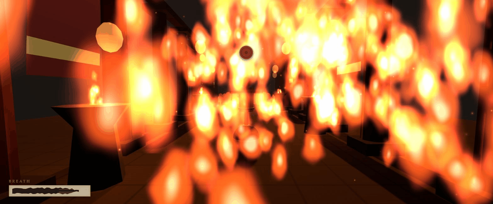
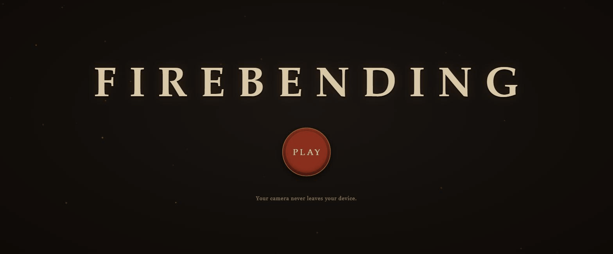
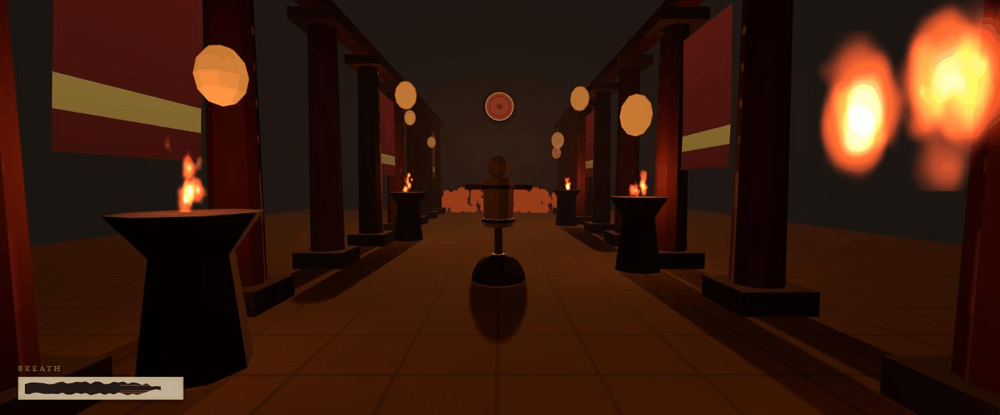

# FIREBENDING



Punch at your webcam and fire comes out of your hands. A browser martial-arts game with no controller, no keyboard, no VR: the camera is the only sensor.

**Try it:** deploy pending, see MORNING.md

## How it works

Your webcam feed goes through MediaPipe hand, body-pose and face landmarkers, entirely on your machine. The raw landmarks pass through One Euro filters and confidence gates so a jittery hand never becomes a jittery flame. Thrusts are detected pose-agnostically from motion alone (elbow extension fused with wrist speed and apparent-size growth), so a punch fires whether your fingers read as a fist or a palm; the grip pose scorer feeds only the whip. A seven-move state machine with hysteresis fires when you commit to a move and never on a single noisy frame. Every projectile and stream is aimed along the filtered velocity of the hand that threw it. The hand is the crosshair.

The pipeline: webcam frame, MediaPipe landmarks, One Euro filtering, motion fusion, seven-move state machine, fire.



## The moveset

| Move | Gesture | Effect |
|---|---|---|
| Cinder Bolt | Quick thrust toward the camera, any hand shape | Fast small fireball along your punch line |
| Kiln Lance | Hold the arm extended after a thrust | Narrow sustained jet, steer it with your hand |
| Third Strike Comet | Three alternating thrusts within 1.5 seconds | The third hit upgrades to a heavy comet with knockback |
| Furnace Shot | Both hands together at the chest, then a joint thrust | Giant fireball, screen shake, slow motion on a kill |
| Kindled Wall | Both hands low, fast upward sweep | Wall of flame that blocks incoming projectiles |
| Cinder Lash | Raised grip held, then a fast sideways swing | Arcing whip crack in the swing direction |
| Inner Coal | Both fists at the hips, held one second | Embers gather at your fists; your next move is empowered |



Moves cost Breath, a stamina meter that regenerates when you are not sustaining a flame. Duck your head to dodge incoming coals, or raise a Kindled Wall to block them.

## Privacy

All processing is client side. The camera feed never leaves your device; landmark detection, filtering, and gesture recognition all run in your browser. The only network fetches at load time are the MediaPipe model files, which come from Google's CDN.

## Local development

```sh
npm install
npm run dev     # dev server
npm test        # 339 headless tests, no camera required
npm run build   # typecheck + production build to dist/
```

The whole game runs without a webcam via recorded landmark fixtures:

- `?replay=NAME` runs the full flow (title, calibration, arena) on a looping synthetic recording, for example `?replay=jab-right`
- `?debug=tracking` filtered-skeleton overlay (`&fixture=name` or `&live`)
- `?debug=moves` move-event scene: cycles all positive fixtures and prints trigger latency
- `?debug=arena` arena environment visual harness
- `?debug=fire` fire system visual harness
- `?debug=perf` scripted stress scene with a frame-time verdict

`tools/capture.html` is a standalone recorder page for capturing real gesture sessions into `fixtures/recorded/`.

## Credits and data

The pose score thresholds were tuned against real hands using the HaGRID dataset (Kapitanov et al.), via the `cj-mills/hagrid-sample-500k-384p` sample on HuggingFace, licensed CC-BY-SA-4.0. Only the landmark annotations were used: no images were downloaded and no models were trained. See `docs/hagrid-report.md` for the full methodology.

## Tech stack

Vite, TypeScript (strict), Three.js, MediaPipe Tasks Vision, Rapier physics (WASM), and pure Web Audio synthesis for every sound. No React, no framework: a game loop, plain TS modules, and a single HTML entry.

## Why

Because your hands are already the best game controller you own. Firebending turns a laptop webcam into a martial-arts input device: punches, palm strikes, and whip swings read as real moves, and the fire goes exactly where your hand sends it. Everything runs in the browser at 60 fps, nothing is uploaded anywhere, and there is nothing to install. Stand up, square off, and throw a punch.
